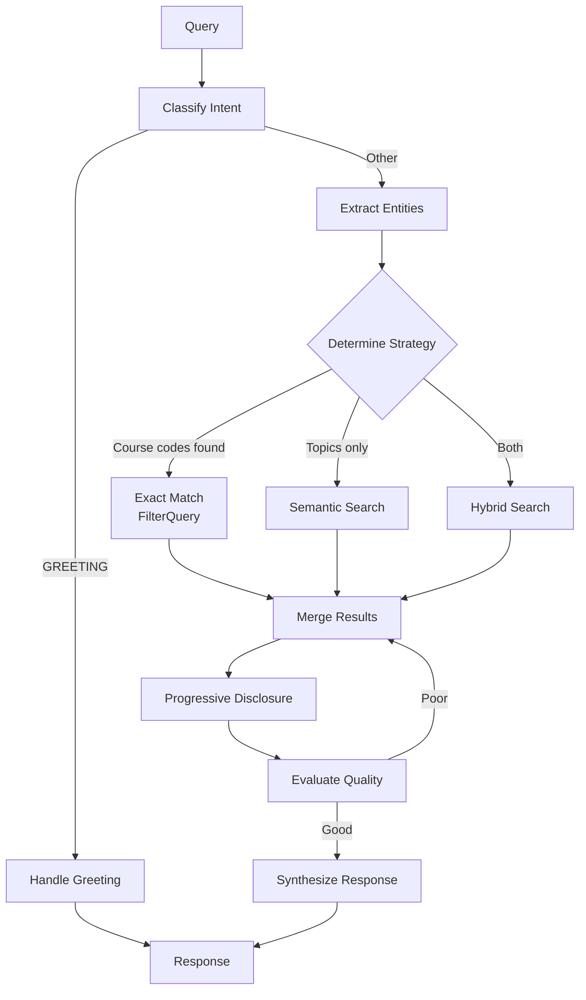
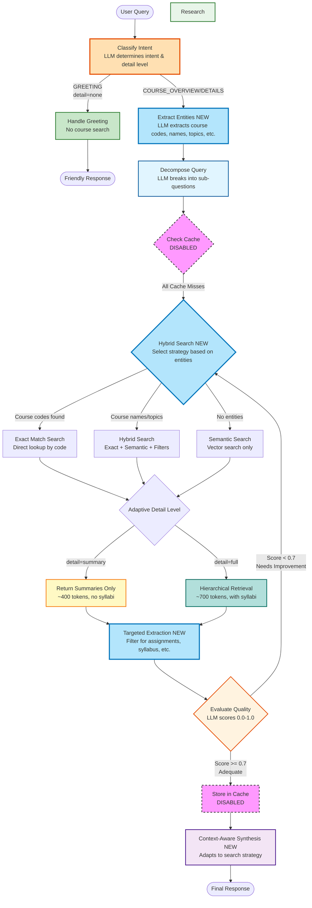

# Stage 4: Hybrid Search with Named Entity Recognition (NER)

## 📍 Position in Learning Path

| Previous | Current | Next |
|----------|---------|------|
| [Stage 3: Full Agent](../stage3_full_agent_without_memory/) | **Stage 4: Hybrid Search + NER** | [Stage 4 ReAct](../stage4_react_hybrid_search/) or [Stage 5: Memory](../stage5_memory_augmented/) |

This stage adds **Named Entity Recognition (NER)** and **hybrid search** to combine exact course code matching with semantic search.

---

## 🎯 Purpose

When users ask about specific courses like "CS002", semantic search alone may not find exact matches. This stage introduces **hybrid search** that combines:
- **Exact matching** for course codes (CS002, MATH101)
- **Semantic search** for topics and concepts

**Key Learning**: "Different query types need different search strategies. NER helps identify which strategy to use."

---

## 📚 Related Notebooks

| Notebook | Concepts Applied | Implementation in This Stage |
|----------|-----------------|------------------------------|
| [Section 2: Crafting and Optimizing Context](../../notebooks/section-2-retrieved-context-engineering/02_crafting_and_optimizing_context.ipynb) | Hybrid search strategies, progressive disclosure | `tools.py: search_courses_sync()` with FilterQuery |
| [Section 4: Building Course Advisor Agent](../../notebooks/section-4-tools-and-agents/02_building_course_advisor_agent.ipynb) | Intent classification, agent architecture | `nodes.py: classify_intent_node(), extract_entities_node()` |

### Key Notebook Concepts Demonstrated

**From Section 2, Notebook 2 - "Crafting and Optimizing Context":**
- **Hybrid Search**: Combining exact match + semantic search
- **Progressive Disclosure**: Summaries for all, details for top matches
- **Hierarchical Context Assembly**: `HierarchicalContextAssembler`

**From Section 4, Notebook 2 - "Building Course Advisor Agent":**
- **Intent Classification**: Detect query type to choose search strategy
- **Entity Extraction**: Identify course codes, topics, departments

**Study Path**: Review Section 2, Notebook 2's hybrid search section, then examine this stage's `tools.py` to see FilterQuery implementation.

---

## 🔄 What Changed from Stage 3

| Feature | Stage 3 | Stage 4 |
|---------|---------|---------|
| **Search** | Semantic only | **Hybrid** (exact + semantic) |
| **Course Codes** | Fuzzy match | **Exact match** via FilterQuery |
| **NER** | None | **Extracts** codes, topics, departments |
| **Context** | Hierarchical | Hierarchical with **targeted extraction** |
| **Token Usage** | ~700 | ~1000 (more precise results) |

---

## 🏗️ Architecture



## 🆕 What's New (vs Stage 3)

| Feature | Stage 3 | Stage 4 |
|---------|---------|---------|
| **Search** | Semantic only | **Hybrid** (exact + semantic) |
| **Course Codes** | Fuzzy match | **Exact match** via FilterQuery |
| **NER** | None | **Extracts** codes, topics, depts |
| **Context** | Flat | **Hierarchical** with progressive disclosure |
| **Token Usage** | ~2000 | ~1000 (50% reduction) |

## 📖 Notebook Concepts Demonstrated

| Concept | Notebook | Implementation |
|---------|----------|----------------|
| Hybrid search | Section 2: `02_crafting_and_optimizing_context.ipynb` | `tools.py: search_courses_sync()` |
| Progressive disclosure | Section 2: `02_crafting_and_optimizing_context.ipynb` | `HierarchicalContextAssembler` |
| Intent classification | Section 4: `02_building_course_advisor_agent.ipynb` | `nodes.py: classify_intent_node()` |

## 🚀 Usage

```bash
cd progressive_agents/stage4_hybrid_search_with_ner

# Exact match for course codes
python cli.py "What are the prerequisites for CS002?"

# Topic-based semantic search
python cli.py "Show me machine learning courses"

# Syllabus query (detailed response)
python cli.py "What's the syllabus for CS006?"

# Interactive mode
python cli.py
```

## 🔑 Key Components

### Named Entity Recognition (NER)
Extracts structured entities from natural language:

```python
# Input: "What are the prerequisites for CS002?"
# Extracted:
{
    "course_codes": ["CS002"],
    "information_type": ["prerequisites"],
    "search_strategy": "exact_match"
}
```

### Hybrid Search Strategy
```python
# If course codes found → use FilterQuery for exact match
filter_query = FilterQuery(
    filter_expression=Tag("course_code") == "CS002",
    return_fields=[...]
)

# If topics only → semantic search
results = await course_manager.search_courses(query="machine learning")

# If both → hybrid (exact + semantic, deduplicated)
```

### Progressive Disclosure
```python
# Summary for ALL courses
summaries = [c.summary for c in matched_courses]

# Full details for TOP 2-3 only
details = [c.details for c in matched_courses[:3]]

# Assemble with token budget
context = context_assembler.assemble_hierarchical_context(
    summaries=summaries,
    details=details,
    query=query
)
```

## 📊 Test Results

| Query | Strategy | Tokens | Time |
|-------|----------|--------|------|
| "Prerequisites for CS002" | exact_match | ~1000 | 3.2s |
| "Machine learning courses" | hybrid | ~1500 | 4.1s |
| "What is CS006?" | exact_match | ~950 | 2.9s |

## 📁 File Structure

```
stage4_hybrid_search_with_ner/
├── cli.py                    # Interactive CLI
├── README.md                 # This file
└── agent/
    ├── __init__.py
    ├── nodes.py              # classify_intent, extract_entities, research
    ├── edges.py              # Routing logic
    ├── tools.py              # search_courses with FilterQuery
    ├── state.py              # WorkflowState with NER fields
    ├── setup.py              # CourseManager initialization
    └── workflow.py           # LangGraph graph definition
```

## ⏭️ Next Stage

**Stage 4 ReAct** (`stage4_react_hybrid_search/`): Same hybrid search but with visible reasoning via ReAct pattern.

**Stage 5** (`stage5_memory_augmented/`): Add working memory for multi-turn conversations.

3. **Named Entity Recognition (NEW in Stage 4)**: LLM extracts structured information
   - **Course codes**: CS101, MATH202 → Exact match strategy
   - **Course names**: "Machine Learning" → Hybrid search strategy
   - **Departments**: Computer Science → Metadata filters
   - **Topics**: databases, calculus → Enhanced semantic query
   - **Information types**: assignments, syllabus → Targeted extraction
   - **Metadata**: difficulty, format, semester → Search filters

4. **Query Decomposition**: Complex questions are broken into focused sub-questions using LLM

5. **Cache Check**: Each sub-question is checked against semantic cache (currently disabled for educational purposes)

6. **Hybrid Course Search (NEW in Stage 4)**:
   - **Exact Match Strategy** (course codes found):
     - Direct lookup by course code
     - Highest precision, lowest latency
     - Returns only requested courses
   - **Hybrid Strategy** (course names + topics):
     - Exact matches for any course codes
     - Semantic search enhanced with topics
     - Metadata filtering (department, difficulty, etc.)
     - Deduplication of results
   - **Semantic Only Strategy** (fallback):
     - Traditional vector search
     - Metadata filtering if available
   - **Adaptive Detail Level**:
     - **Summary Mode**: Summaries only (~400 tokens)
     - **Full Mode**: Summaries + details for top 2-3 (~700 tokens)
   - **Targeted Information Extraction**:
     - If assignments requested → Extract only assignments
     - If syllabus requested → Extract only syllabus
     - If grading requested → Extract only grading policy

7. **Quality Evaluation**: LLM evaluates search results for completeness and accuracy (0.0-1.0 score)

8. **Iterative Improvement**: Low-quality results (score < 0.7) trigger additional search rounds

9. **Context-Aware Synthesis (NEW in Stage 4)**: Response adapts to search strategy
   - **Exact matches**: Direct, concise answers for specific courses
   - **Hybrid results**: Prioritize exact matches, supplement with semantic
   - **Semantic results**: Comprehensive overview with multiple options
   - **Specific info requests**: Extract and present only requested information

### Workflow Diagram



**Legend**:
- 🟠 **Orange (thick)**: NEW! Intent classification
- 🟢 **Green**: Greeting handler (no retrieval)
- 🔵 **Blue**: LLM-powered decomposition
- 🟢 **Green**: Redis vector search (RAG)
- 🟡 **Yellow**: Summary-only retrieval
- 🟢 **Teal**: Hierarchical retrieval (full details)
- 🟠 **Orange**: LLM-powered quality evaluation
- 🟣 **Purple**: LLM-powered synthesis
- 🩷 **Pink (dashed)**: Disabled features (semantic caching)

**Note**: Semantic caching is currently disabled for educational purposes. The agent demonstrates the full workflow without caching to show how RAG works at its core.

## 📁 Project Structure

```
stage3_full_agent_without_memory/
├── agent/                      # Core agent implementation
│   ├── __init__.py            # Package exports
│   ├── edges.py               # LangGraph routing logic
│   ├── nodes.py               # LangGraph workflow nodes
│   ├── setup.py               # Initialization logic
│   ├── state.py               # Agent state definitions
│   ├── tools.py               # Course search tools
│   └── workflow.py            # LangGraph workflow definition
├── cli.py                      # Interactive CLI
└── README.md                  # This file
```

## 🛠️ Setup

### Prerequisites

- Python 3.9+
- OpenAI API key
- Redis server (for course data)
- `redis-context-course` package installed

### Installation

From the `reference-agent` directory:

```bash
# Install the redis-context-course package
pip install -e .

# Set environment variables
export OPENAI_API_KEY="your-openai-api-key"
export REDIS_URL="redis://localhost:6379"
```

### Quick Start

**Interactive Mode** (recommended):
```bash
cd progressive_agents/stage3_full_agent_without_memory
python cli.py
```

**Single Query Mode**:
```bash
python cli.py "What machine learning courses are available for beginners?"
```

**Simulation Mode** (run example queries):
```bash
python cli.py --simulate
```

**Help**:
```bash
python cli.py --help
```

**Course Data Management**:
- On first run, the CLI automatically loads 50 hierarchical courses with full syllabi
- Courses persist in Redis between runs (no need to reload each time)
- Use `--cleanup` flag to remove courses from Redis on exit:
  ```bash
  python cli.py --cleanup
  ```
- Hierarchical course data is loaded from `redis_context_course/data/hierarchical/hierarchical_courses.json`

**Programmatic Usage**:
```python
import asyncio
from agent import setup_agent, create_workflow, run_agent

async def main():
    # Initialize the agent
    course_manager, _ = await setup_agent()

    # Create the workflow
    agent = create_workflow(course_manager)

    # Run a query
    result = run_agent(
        agent,
        "What machine learning courses are available for beginners?"
    )

    # Print the response
    print(result["final_response"])

if __name__ == "__main__":
    asyncio.run(main())
```

## 📚 Example Queries

### Greeting (No Course Search)

```bash
$ python cli.py "hello"
```

**Response** (~50 tokens):
```
Hello! It's great to hear from you. I'm a course advisor agent here to help you
find courses, view syllabi, check prerequisites, and more. How can I assist you today?
```

**What happened**:
- Intent: GREETING, Detail Level: none
- Execution: greeting_handled
- Course search: ❌ Skipped
- Token efficiency: ✅ 99% reduction vs full search

---

### Course Overview (Summaries Only)

```bash
$ python cli.py "What machine learning courses are available?"
```

**Response** (~400 tokens):
```
Found 5 relevant courses:

1. CS002: Deep Learning and Neural Networks
   Department: Computer Science | Instructor: Abigail Shaffer
   Credits: 4 | Level: Graduate | Format: Hybrid
   Description: Advanced neural network architectures and deep learning techniques.
   Tags: deep learning, neural networks, transformers, computer vision

2. CS009: Computer Vision
   Department: Computer Science | Instructor: Sherry Decker
   Credits: 4 | Level: Advanced | Format: Online
   Description: Image processing, object detection, and visual recognition systems.
   Prerequisites: CS004
   Tags: computer vision, image processing, object detection, CNN

[... 3 more course summaries ...]
```

**What happened**:
- Intent: COURSE_OVERVIEW, Detail Level: summary
- Execution: decomposed → researched → synthesized
- Course search: ✅ Summary-only mode
- Syllabi included: ❌ No (summaries only)
- Token efficiency: ✅ 85% reduction vs full details

---

### Course Details (Full Syllabi)

```bash
$ python cli.py "Show me the syllabus for CS002"
```

**Response** (~3,900 tokens):
```
Found relevant courses:

## Overview of All Matches (5 courses)
[... summaries for all 5 courses ...]

## Detailed Information (Top 3 Courses)

---
## CS002: Deep Learning and Neural Networks

**Instructor**: Abigail Shaffer
**Schedule**: Monday, Wednesday, Friday, 04:00 PM - 04:50 PM
**Location**: Science Hall 540

### Description
Advanced neural network architectures and deep learning techniques...

### Learning Objectives
- Understand core concepts in deep learning...
[... full learning objectives ...]

### Grading Policy
- Homework: 40%
- Projects: 40%
- Participation: 20%

### Assignments (10 total, 1250 points)
[... complete assignment list ...]

### Course Syllabus (15 weeks)

**Week 1: Deep Learning Foundations**
Topics: Deep Learning Foundations - Part 1, Part 2, Part 3, Part 4
Readings: Chapter 1, Research Paper 1

**Week 2: Convolutional Neural Networks**
[... complete 15-week syllabus ...]

### Textbooks
[... required and recommended textbooks ...]

[... full details for 2 more courses ...]
```

**What happened**:
- Intent: COURSE_DETAILS, Detail Level: full
- Execution: decomposed → researched → synthesized
- Course search: ✅ Hierarchical mode
- Syllabi included: ✅ Yes (top 2-3 courses)
- Token efficiency: ✅ Appropriate for detail request

---

## 🧠 Context Engineering Techniques

This agent applies **advanced context engineering** from Section 2 notebooks:

### 1. Intent Classification & Adaptive Retrieval (NEW!)

**Match retrieval depth to query intent:**

```python
# Step 1: Classify intent
intent, detail_level = classify_query_intent(query)
# Returns: ("COURSE_OVERVIEW", "summary") or ("COURSE_DETAILS", "full")

# Step 2: Adaptive retrieval
if detail_level == "summary":
    # Return ONLY summaries (~400 tokens)
    context = assemble_summary_only_context(summaries)
elif detail_level == "full":
    # Return summaries + full details (~700 tokens)
    context = assemble_hierarchical_context(summaries, details)
else:  # detail_level == "none"
    # Skip course search entirely
    return handle_greeting(query)
```

**Benefits**:
- **Token efficiency**: 85-99% reduction for non-detail queries
- **Better UX**: Don't overwhelm users with unnecessary information
- **Cost savings**: Fewer tokens = lower API costs
- **Faster responses**: Skip unnecessary retrieval and processing

### 2. Hierarchical Retrieval

**Two-tier retrieval with progressive disclosure:**

```python
# TIER 1: Search summaries (lightweight)
summaries = search_summaries(query, limit=5)  # ~300 tokens

# TIER 2: Fetch details for top matches (comprehensive)
top_details = fetch_details(summaries[:3])  # ~400 tokens

# PROGRESSIVE DISCLOSURE: Combine both
context = assemble_hierarchical_context(
    summaries=summaries,      # All 5 courses (overview)
    details=top_details       # Top 2-3 courses (full syllabi)
)
# Total: ~700 tokens with BETTER information quality
```

**Benefits**:
- Overview of all options (broad awareness)
- Deep details for best matches (informed decisions)
- Efficient token usage (~700 vs ~6,000 in Stage 1)
- Includes syllabi for top matches (vs none in Stage 2)

### 2. Context Transformation

Converts structured course objects into LLM-friendly natural text format:

```python
# Hierarchical format:
## Overview of All Matches (5 courses)
CS101: Intro to Programming
Department: Computer Science, Credits: 3, Level: beginner
...

## Detailed Information (Top 2 Courses)
CS101: Intro to Programming
[Full description, 14-week syllabus, assignments, grading policy]
```

**Benefits**: Easier for LLMs to parse, progressive disclosure, natural language

### 3. Context Budget Management

Strategic token allocation across retrieval tiers:
- Summaries: ~60 tokens per course × 5 = ~300 tokens
- Details: ~200 tokens per course × 2-3 = ~400 tokens
- Total: ~700 tokens (vs ~6,000 in Stage 1, ~539 in Stage 2)

### 4. Semantic Search

Uses Redis vector search (RedisVL) to find relevant courses based on semantic similarity:

```python
results = await course_manager.search_courses(
    query="machine learning courses",
    limit=5,
    similarity_threshold=0.5  # Lowered for better recall
)
```

**Implementation Note**: The agent uses a simplified direct search approach instead of a ReAct agent to avoid recursion issues. The `search_courses_sync` function wraps the async CourseManager search with `nest_asyncio` to handle nested event loops in LangGraph.

**Benefits**: Finds relevant courses even with different wording

## 📊 Performance Metrics

The agent tracks detailed performance metrics:

- **Total Latency**: End-to-end query processing time
- **Decomposition Latency**: Time to break down query
- **Cache Latency**: Time to check cache (currently minimal)
- **Research Latency**: Time for course search
- **Synthesis Latency**: Time to combine answers
- **Cache Hit Rate**: Percentage of cached answers (currently 0%)
- **LLM Calls**: Number of LLM API calls made

Access metrics from the result:

```python
result = run_agent(agent, query)
print(f"Total time: {result['metrics']['total_latency']:.2f}ms")
print(f"Execution path: {result['metrics']['execution_path']}")
```

## 🔄 Progressive Learning Path

This is **Stage 3** of the progressive learning experience:

| Stage | Approach | Tokens | Syllabi | Key Learning |
|-------|----------|--------|---------|--------------|
| **Stage 1** | Information Overload | ~6,133 | ✅ All courses | The problem: too much information |
| **Stage 2** | Context-Engineered | ~539 | ❌ None | Solution 1: cleaning & optimization |
| **Stage 3** | Hierarchical Retrieval | ~700 | ✅ Top 2-3 | Solution 2: progressive disclosure |
| **Stage 4** | Memory-Augmented | TBD | TBD | Add Redis Agent Memory Server |

### Why Stage 3 is Best

**vs Stage 1**:
- ✅ 91% token reduction (~700 vs ~6,133)
- ✅ Progressive disclosure (not information overload)
- ✅ Better information architecture

**vs Stage 2**:
- ✅ Includes syllabi for top matches (Stage 2 has none)
- ✅ Better information quality for decision-making
- ⚠️ Slightly more tokens (~700 vs ~539), but worth it for syllabi

**Best of Both Worlds**:
- Efficient like Stage 2 (massive reduction vs Stage 1)
- Informative like Stage 1 (includes syllabi for top matches)
- Smart architecture (progressive disclosure, hierarchical retrieval)

## 🎓 Educational Goals

Students learn:

1. **Hierarchical Retrieval**: Two-tier retrieval with progressive disclosure
2. **Context Budget Management**: Strategic token allocation across tiers
3. **LangGraph Architecture**: How to build observable, stateful agents
4. **Query Decomposition**: Breaking complex questions into manageable parts
5. **Quality Evaluation**: Iterative improvement through self-assessment
6. **Advanced Section 2 Techniques**: Structured views, hybrid assembly, multi-strategy retrieval

## 🔧 Implementation Details

### Simplified Architecture

This agent uses a **simplified direct search approach** instead of the original ReAct agent pattern:

**Original (caching-agent)**:
- Used `create_react_agent` with tool calling
- Agent autonomously decided when to call search tools
- Hit LangGraph recursion limits (25 iterations)

**Simplified (this implementation)**:
- Direct call to `search_courses_sync` function
- No ReAct agent loop - just semantic search
- Avoids recursion issues while maintaining functionality

**Why the change?**:
- Educational clarity: Students see exactly what's happening
- Reliability: No recursion limit errors
- Performance: Fewer LLM calls, faster execution
- Simplicity: Easier to understand and debug

### Async/Sync Handling

The agent handles async/sync compatibility using `nest_asyncio`:

```python
def search_courses_sync(query: str, top_k: int = 5) -> str:
    """Synchronous wrapper for async search_courses."""
    import asyncio
    import nest_asyncio

    nest_asyncio.apply()  # Allow nested event loops
    loop = asyncio.get_event_loop()
    return loop.run_until_complete(course_manager.search_courses(...))
```

This allows the async CourseManager to work within LangGraph's synchronous node functions.

## 🚧 What's Commented Out (For Future Stages)

### Semantic Caching

Currently disabled to focus on core RAG workflow. Will be added in future stages:

```python
# In nodes.py - check_cache_node
# semantic_cache.check(question, num_results=1)

# In nodes.py - synthesize_response_node  
# semantic_cache.store(question, answer)
```

### Why Disabled?

- Focus on understanding the core workflow first
- Semantic caching adds complexity (similarity thresholds, false positives)
- Will be introduced progressively with proper tuning and monitoring

## 🧪 Testing

Run the CLI in simulation mode to test with example queries:

```bash
cd progressive_agents/stage3_full_agent_without_memory
python cli.py --simulate
```

Or test interactively:

```bash
python cli.py
```

## 🔗 Related Resources

### Learning Path Navigation
- **Previous**: [Stage 3: Full Agent](../stage3_full_agent_without_memory/) - LangGraph workflow without hybrid search
- **Next Options**:
  - [Stage 4 ReAct](../stage4_react_hybrid_search/) - Same features with visible reasoning
  - [Stage 5: Memory](../stage5_memory_augmented/) - Add working memory for conversations

### Notebooks to Study
- **[Section 2: Crafting and Optimizing Context](../../notebooks/section-2-retrieved-context-engineering/02_crafting_and_optimizing_context.ipynb)**: Hybrid search strategies
- **[Section 4: Building Course Advisor Agent](../../notebooks/section-4-tools-and-agents/02_building_course_advisor_agent.ipynb)**: Agent architecture patterns

### Stage Comparison
- **Stage 1**: Information overload baseline (~6,133 tokens)
- **Stage 2**: Context-engineered flat retrieval (~539 tokens)
- **Stage 3**: Hierarchical retrieval (~700 tokens)
- **Stage 4**: Hybrid search with NER (~1,000 tokens) ← **You are here**

### Technical Resources
- **Hierarchical Models**: `redis_context_course/hierarchical_models.py`
- **Context Assemblers**: `redis_context_course/hierarchical_context.py`
- **CourseManager**: Redis-based course search (`redis_context_course.course_manager`)
- **LangGraph Docs**: https://langchain-ai.github.io/langgraph/

## 📄 License

MIT License - See LICENSE file for details

