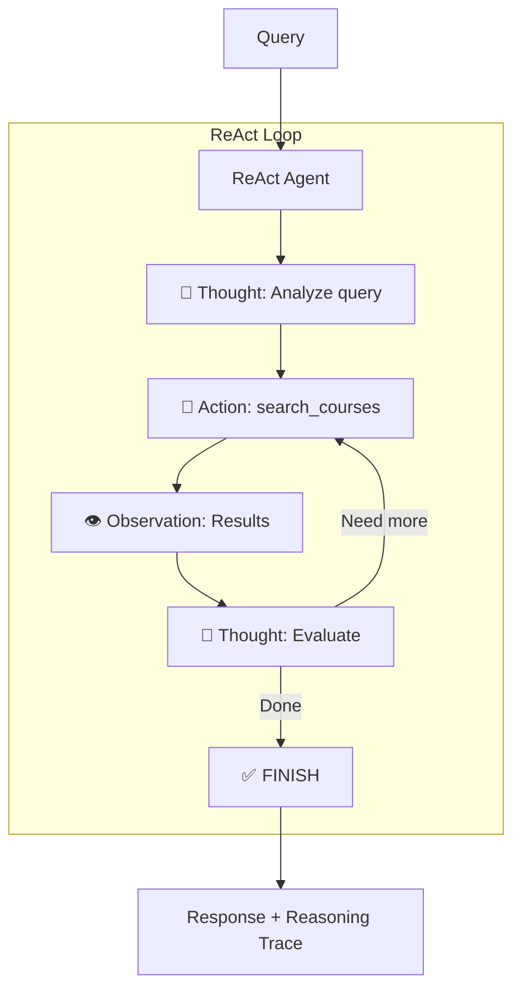

# Stage 4 ReAct: Hybrid Search with ReAct Loop

This stage combines the hybrid search capabilities of Stage 4 with an explicit **ReAct** (Reasoning + Acting) loop for transparent reasoning.

## 🏗️ Architecture



## 🆕 What's New (vs Stage 4)

| Feature | Stage 4 | Stage 4 ReAct |
|---------|---------|---------------|
| **Reasoning** | Hidden (tool-calling) | **Visible** (Thought → Action → Observation) |
| **Decision Process** | Opaque LLM | **Transparent** reasoning trace |
| **Debugging** | Harder | **Easier** with `--show-reasoning` |
| **Iterations** | 1 | 2-3 (explicit loop) |

## 📖 Notebook Concepts Demonstrated

| Concept | Notebook | Implementation |
|---------|----------|----------------|
| ReAct pattern | Section 4: `01_tools_and_langgraph_fundamentals.ipynb` | `react_agent.py` |
| Hybrid search | Section 2: `02_crafting_and_optimizing_context.ipynb` | `tools.py: search_courses_sync()` |
| Progressive disclosure | Section 2: `02_crafting_and_optimizing_context.ipynb` | `HierarchicalContextAssembler` |

## 🚀 Usage

```bash
cd progressive_agents/stage4_react_hybrid_search

# Single query
python cli.py "What are the prerequisites for CS002?"

# Show reasoning trace
python cli.py --show-reasoning "What are the prerequisites for CS009?"

# Interactive mode
python cli.py

# Debug mode
python cli.py --debug "What's the syllabus for CS006?"
```

## 📁 File Structure

```
stage4_react_hybrid_search/
├── cli.py                    # Interactive CLI with --show-reasoning
├── README.md                 # This file
└── agent/
    ├── __init__.py          # Module exports
    ├── react_agent.py       # ReAct loop implementation
    ├── react_parser.py      # Output parsing (max_length=8000)
    ├── react_prompts.py     # System prompt with examples
    ├── tools.py             # search_courses tool with FilterQuery
    ├── state.py             # WorkflowState with reasoning_trace
    ├── setup.py             # CourseManager initialization
    └── workflow.py          # LangGraph workflow
```

## Key Fixes Applied

1. **Hierarchical Path**: Uses correct path `parent.parent.parent.parent / "src"`
2. **FilterQuery**: Exact course code matching instead of semantic search
3. **Observation Length**: 8000 chars to prevent syllabus truncation
4. **Empty Data Handling**: Prompt guidance for empty prerequisites

## Test Results

| Query | Time | Iterations | Result |
|-------|------|------------|--------|
| CS002 prerequisites (empty) | 5.1s | 2 | ✅ "no formal prerequisites" |
| CS009 prerequisites (has CS002) | 3.3s | 2 | ✅ "requires CS002" |
| CS006 syllabus | 7.3s | 2 | ✅ Full syllabus returned |

## Comparison with Other Stages

| Feature | Stage 4 | Stage 4 ReAct | Stage 7 |
|---------|---------|---------------|---------|
| Search | Hybrid | Hybrid | Hybrid |
| Reasoning | Hidden | **Visible** | Visible |
| Memory | None | None | Long-term |
| Iterations | 1 | 2 | 2-3 |

## Example Reasoning Trace

```
🧠 Reasoning Trace:
================================================================================
💭 Thought: The user is asking about prerequisites. I'll use exact match.

🔧 Action: search_courses
   Input: {"query": "CS002", "intent": "PREREQUISITES", "search_strategy": "exact_match", ...}
👁️  Observation: Found CS002 - Machine Learning Fundamentals...

💭 Thought: I found the course info. Prerequisites field is empty - this means no prerequisites required.

✅ FINISH
================================================================================
```

## ⏭️ Next Stage

**Stage 5 React** (`stage5_react_memory/`): Add working memory for multi-turn conversations while keeping visible reasoning.

