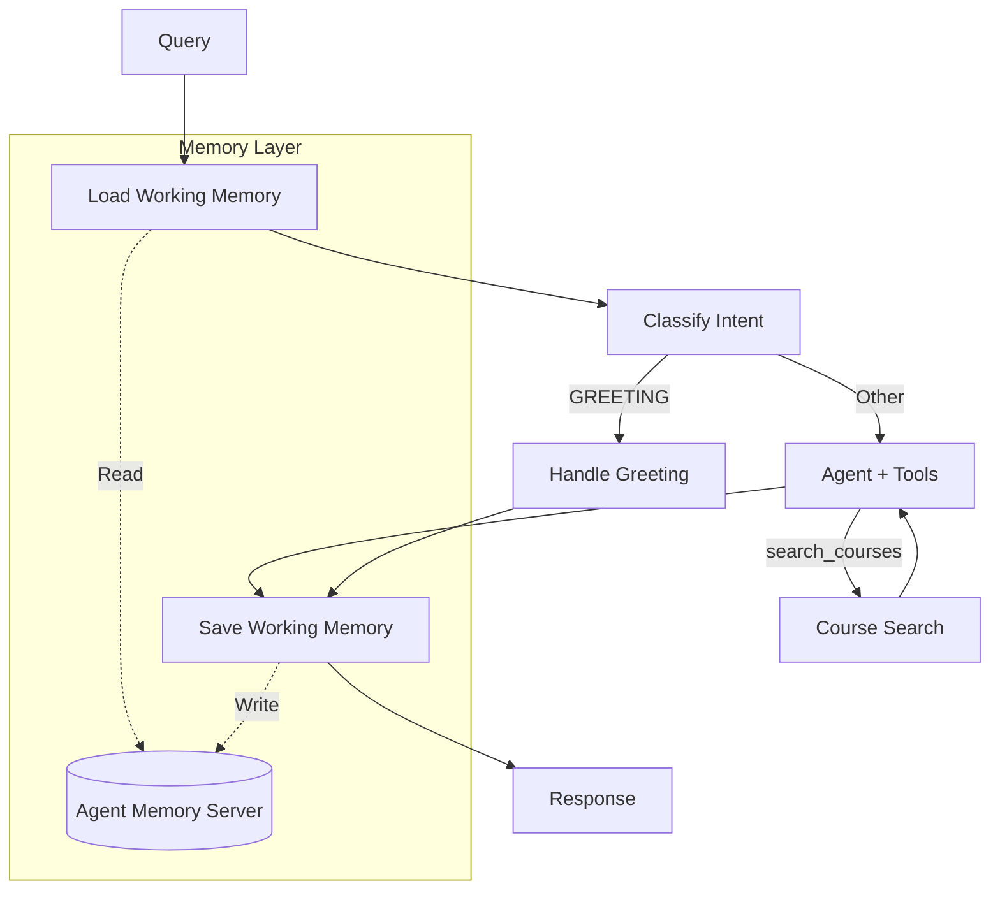

# Stage 5: Memory-Augmented Agent (Tool-Calling)

## 📍 Position in Learning Path

| Previous | Current | Next |
|----------|---------|------|
| [Stage 4: Hybrid Search](../stage4_hybrid_search_with_ner/) or [Stage 4 ReAct](../stage4_react_hybrid_search/) | **Stage 5: Memory** | [Stage 5 ReAct](../stage5_react_memory/) or [Stage 6: Long-term Memory](../stage6_longterm_memory/) |

This stage adds **working memory** using Redis Agent Memory Server for multi-turn conversations.

---

## 🎯 Purpose

Previous stages treated each query independently. This stage introduces **working memory** to enable:
- Multi-turn conversations with context
- Follow-up questions ("What about that course?")
- Session resumption

**Key Learning**: "Working memory enables conversation continuity. The agent can now reference previous turns."

---

## 📚 Related Notebooks

This stage directly implements concepts from Section 3:

| Notebook | Concepts Applied | Implementation in This Stage |
|----------|-----------------|------------------------------|
| [Section 3: Working and Long-term Memory](../../notebooks/section-3-memory-systems/01_working_and_longterm_memory.ipynb) | Working memory, grounding problem | `nodes.py: load/save_working_memory_node()` |
| [Section 3: Combining Memory with Retrieved Context](../../notebooks/section-3-memory-systems/02_combining_memory_with_retrieved_context.ipynb) | Memory + RAG integration | Agent combines history + search |
| [Section 4: Tools and LangGraph Fundamentals](../../notebooks/section-4-tools-and-agents/01_tools_and_langgraph_fundamentals.ipynb) | Tool calling patterns | `agent_node()` with `bind_tools()` |

### Key Notebook Concepts Demonstrated

**From Section 3, Notebook 1 - "Working and Long-term Memory":**
- **The Grounding Problem**: Why "What are its prerequisites?" fails without memory
- **Working Memory**: Session-scoped conversation storage
- **Memory Lifecycle**: Load → Process → Save pattern

**From Section 3, Notebook 2 - "Combining Memory with Retrieved Context":**
- **All Four Context Types**: System + User + Conversation + Retrieved
- **Memory-Enhanced RAG**: Combining conversation history with search results
- **Stateful Conversations**: Building context across turns

**Study Path**: Read Section 3, Notebooks 1-2 to understand memory theory, then examine this stage's `nodes.py` to see the load/save implementation.

---

## 🔄 What Changed from Stage 4

| Feature | Stage 4 | Stage 5 |
|---------|---------|---------|
| **Memory** | None | **Working memory** (session-scoped) |
| **Multi-turn** | Each query independent | **Conversation continuity** |
| **Session** | None | **Resume by session_id** |
| **Follow-ups** | "What about that?" fails | **Pronoun resolution** |
| **Reasoning** | Hidden (tool-calling) | Hidden (tool-calling) |

---

## 🏗️ Architecture



## 📝 Example Conversation Flow

```
Turn 1:
User: "What is CS004?"
Agent: "CS004 is Computer Vision, an advanced course covering image processing..."
       [Saves to working memory]

Turn 2 (same session):
User: "What are the prerequisites?"
Agent: [Loads working memory, sees CS004 context]
       "CS004 requires CS201 (Data Structures) and MATH301 (Linear Algebra)..."

Turn 3 (same session):
User: "Show me the syllabus"
Agent: [Loads working memory, knows we're talking about CS004]
       "Here's the syllabus for CS004..."

Turn 4 (new session, same student):
User: "What courses did I ask about before?"
Agent: [Loads long-term memory, finds CS004 from auto-extraction]
       "You previously asked about CS004 (Computer Vision)..."
```

## 🔧 Implementation Details

### Memory Nodes

**1. Load Working Memory Node**
- Runs at the start of each turn
- Retrieves conversation history from Agent Memory Server
- Adds previous messages to state for context

**2. Save Working Memory Node**
- Runs at the end of each turn
- Converts LangChain messages to MemoryMessage format
- Saves to Agent Memory Server
- Triggers automatic extraction to long-term memory

### State Updates

Added fields to `AgentState`:
```python
session_id: str                    # Session identifier for continuity
student_id: str                    # User identifier
working_memory_loaded: bool        # Track if memory was loaded
conversation_history: List[Dict]   # Previous messages from working memory
```

### Workflow Changes

```python
# Memory integration
workflow.set_entry_point("load_memory")      # Start by loading memory
workflow.add_edge("load_memory", "classify_intent")
# ... existing Stage 4 nodes ...
workflow.add_edge("synthesize", "save_memory")  # End by saving memory
workflow.add_edge("save_memory", END)
```

## 🚀 Usage

### Prerequisites

1. **Agent Memory Server must be running**:
```bash
# Check if running
curl http://localhost:8088/v1/health

# Start if needed (see reference-agent/README.md)
docker run -d --name agent-memory-server \
  -p 8088:8000 \
  -e REDIS_URL=redis://host.docker.internal:6379 \
  -e OPENAI_API_KEY=your-key \
  ghcr.io/redis/agent-memory-server:0.12.3
```

2. **Environment variables**:
```bash
export OPENAI_API_KEY=your-key
export AGENT_MEMORY_URL=http://localhost:8088  # Optional, defaults to this
```

### Running the Agent

**Single query**:
```bash
python -m progressive_agents.stage5_memory_augmented.cli \
  --student-id alice \
  --session-id session_001 \
  "What is CS004?"
```

**Interactive multi-turn conversation**:
```bash
python -m progressive_agents.stage5_memory_augmented.cli \
  --student-id alice \
  --session-id session_001 \
  --interactive
```

**Resume previous session**:
```bash
# Same session_id loads previous conversation
python -m progressive_agents.stage5_memory_augmented.cli \
  --student-id alice \
  --session-id session_001 \
  --interactive
```

## 🎓 Learning Objectives

After studying this stage, you should understand:

1. **Working Memory Pattern**
   - Session-scoped conversation storage
   - Load → Process → Save lifecycle
   - Difference from LangGraph checkpointing

2. **Memory Integration with RAG**
   - How memory complements retrieval
   - When to use memory vs. search
   - Combining conversation context with retrieved data

3. **Agent Memory Server**
   - Automatic extraction to long-term memory
   - Memory deduplication and compaction
   - Semantic search over memories

4. **Multi-turn Conversations**
   - Building context across turns
   - Handling follow-up questions
   - Session management

## 🔍 Key Differences from Reference Agent

The reference agent (`redis_context_course/agent.py`) includes:
- Long-term memory tools (search_memories, store_memory)
- LangGraph checkpointing for graph state persistence
- More complex tool orchestration

Stage 5 focuses on:
- **Working memory only** (simpler, more focused)
- No long-term memory tools (auto-extraction handles it)
- No checkpointing (not needed for this demo)
- Educational clarity over production features

## 🔍 Code References & Automatic Behaviors

This section provides exact code references for key concepts and documents **automatic behaviors** from the Agent Memory Server that are not explicitly coded but happen behind the scenes.

### Working Memory Implementation

**Code References:**

| Concept | File | Lines | Description |
|---------|------|-------|-------------|
| Load Memory Node | `progressive_agents/stage5_memory_augmented/agent/nodes.py` | 86-141 | `load_working_memory_node()` - retrieves conversation history |
| Save Memory Node | `progressive_agents/stage5_memory_augmented/agent/nodes.py` | 144-200 | `save_working_memory_node()` - persists conversation |
| Memory Client | `progressive_agents/stage5_memory_augmented/agent/nodes.py` | 106, 165 | `get_memory_client()` - Agent Memory Server connection |
| Workflow Integration | `progressive_agents/stage5_memory_augmented/agent/workflow.py` | Entry/Exit | Memory nodes at start and end of workflow |

**Load → Process → Save Pattern:**

```python
# From progressive_agents/stage5_memory_augmented/agent/nodes.py (lines 86-141)
async def load_working_memory_node(state: WorkflowState) -> WorkflowState:
    """Load working memory from Agent Memory Server."""
    _, working_memory = await memory_client.get_or_create_working_memory(
        session_id=session_id,
        user_id=student_id,
        model_name="gpt-4o-mini",
    )
    # Convert to conversation history for LLM context
    for msg in working_memory.messages:
        conversation_history.append({"role": msg.role, "content": msg.content})
```

### Automatic Behaviors (Agent Memory Server)

The Agent Memory Server provides **automatic compression and memory management** that is NOT explicitly coded in the progressive agents but happens behind the scenes:

| Automatic Behavior | How It Works | Configuration |
|-------------------|--------------|---------------|
| **Truncation Strategy** | Limits conversation to `WINDOW_SIZE` messages | `WINDOW_SIZE` environment variable |
| **Sliding Window** | Keeps most recent N messages when threshold exceeded | Automatic when `message_threshold` reached |
| **LLM-Based Summarization** | Summarizes older messages to reduce tokens | `MemoryStrategyConfig(strategy="summary")` |
| **Automatic Extraction** | Extracts important facts to long-term memory | Runs automatically on `put_working_memory()` |
| **Memory Deduplication** | Prevents duplicate memories | Built into Agent Memory Server |

**Configuration Options (from Section 3, Notebook 3):**

```python
# These options are available but use defaults in progressive agents
MemoryStrategyConfig(
    strategy="summary",           # or "recent_plus_summary", "sliding_window", "full_summary"
    max_summary_length=500,       # Max tokens for summary
    message_threshold=20,         # Summarize after N messages
    token_threshold=4000,         # Summarize after N tokens
    keep_recent=4,                # Keep N recent messages unsummarized
)
```

**What This Means for Learners:**

The progressive agents use **default settings**, which means:
- Compression happens automatically when conversations get long
- You don't need to implement compression yourself
- The Agent Memory Server handles memory lifecycle management

To see compression in action, refer to **[Section 3, Notebook 3: Managing Long Conversations](../../notebooks/section-3-memory-systems/03_manage_long_conversations_with_compression_strategies.ipynb)** which demonstrates explicit configuration.

### Inherited Behaviors (From Previous Stages)

| Behavior | Inherited From | How It Works |
|----------|---------------|--------------|
| **Progressive Disclosure** | Stage 3 | `HierarchicalContextAssembler` for context assembly |
| **Hybrid Search** | Stage 4 | Exact + semantic search strategies |
| **"Lost in the Middle" Mitigation** | Stage 3 | Header → Summaries → Details structure |

---

## 🔗 Related Resources

### Learning Path Navigation
- **Previous**: [Stage 4: Hybrid Search](../stage4_hybrid_search_with_ner/) or [Stage 4 ReAct](../stage4_react_hybrid_search/)
- **Next Options**:
  - [Stage 5 ReAct](../stage5_react_memory/) - Same features with visible reasoning
  - [Stage 6: Long-term Memory](../stage6_longterm_memory/) - Add explicit memory tools

### Notebooks to Study
- **[Section 3: Working and Long-term Memory](../../notebooks/section-3-memory-systems/01_working_and_longterm_memory.ipynb)**: Memory fundamentals
- **[Section 3: Combining Memory with Retrieved Context](../../notebooks/section-3-memory-systems/02_combining_memory_with_retrieved_context.ipynb)**: Memory + RAG integration
- **[Section 3: Managing Long Conversations](../../notebooks/section-3-memory-systems/03_manage_long_conversations_with_compression_strategies.ipynb)**: Compression strategies (shows automatic behaviors in detail)

### Technical Resources
- **Reference Agent**: Production-ready implementation with full memory architecture
- **Agent Memory Server**: https://github.com/redis/agent-memory-server

