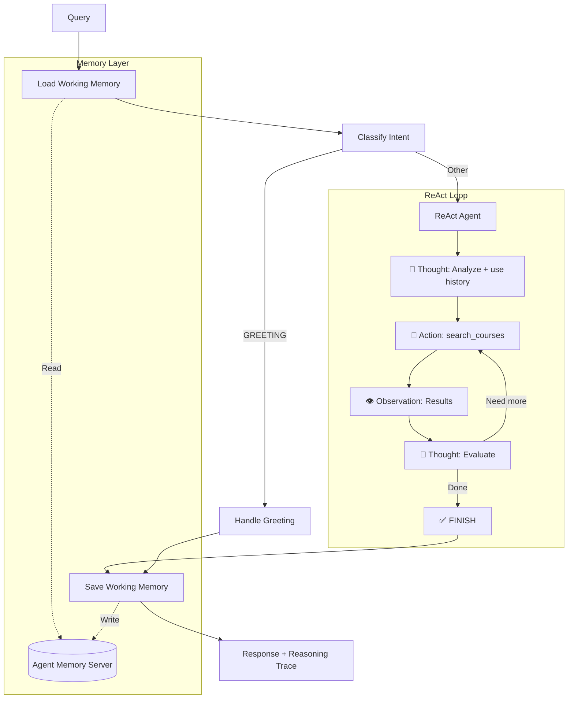

# Stage 5 ReAct: Working Memory with Visible Reasoning

This stage combines **working memory** with the **ReAct** (Reasoning + Acting) loop for transparent multi-turn conversations.

## 🏗️ Architecture



## 🆕 What's New (vs Stage 5 Memory-Augmented)

| Feature | Stage 5 (Tool-Calling) | Stage 5 ReAct |
|---------|------------------------|---------------|
| **Memory** | ✅ Working memory | ✅ Working memory |
| **Multi-turn** | ✅ Conversation continuity | ✅ Conversation continuity |
| **Reasoning** | Hidden (tool-calling) | **Visible** (Thought → Action → Observation) |
| **Debugging** | Harder | **Easier** with `--show-reasoning` |

## 📖 Notebook Concepts Demonstrated

| Concept | Notebook | Implementation |
|---------|----------|----------------|
| ReAct pattern | Section 4: `01_tools_and_langgraph_fundamentals.ipynb` | `react_agent.py: ReActAgent` |
| Working memory | Section 3: `01_working_and_longterm_memory.ipynb` | `nodes.py: load/save_working_memory_node()` |
| Memory + RAG | Section 3: `02_combining_memory_with_retrieved_context.ipynb` | Agent combines history + search |

## 🚀 Usage

```bash
cd progressive_agents/stage5_react_memory

# Multi-turn with visible reasoning
python cli.py --student-id alice --session-id s1 --show-reasoning "What is CS004?"
python cli.py --student-id alice --session-id s1 --show-reasoning "Tell me more about it"

# Interactive mode
python cli.py --student-id alice
```

## 📝 Example: Multi-turn with Reasoning Trace

```
Turn 1:
User: "What is CS004?"

🧠 Reasoning Trace:
================================================================================
💭 Thought: The user is asking about a specific course. I'll use exact match.

🔧 Action: search_courses
   Input: {"query": "CS004", "intent": "GENERAL", "search_strategy": "exact_match"}
👁️  Observation: Found CS004 - Computer Vision...

💭 Thought: I have the course information. I can provide a complete answer.

✅ FINISH
================================================================================

Answer: CS004 is Computer Vision, an advanced course covering image processing...
       [Saves to working memory]

Turn 2 (same session):
User: "What are the prerequisites?"
Agent: [Loads working memory, sees CS004 context]
       "CS004 requires CS201 (Data Structures) and MATH301 (Linear Algebra)..."

Turn 3 (same session):
User: "Show me the syllabus"
Agent: [Loads working memory, knows we're talking about CS004]
       "Here's the syllabus for CS004..."

Turn 4 (new session, same student):
User: "What courses did I ask about before?"
Agent: [Loads long-term memory, finds CS004 from auto-extraction]
       "You previously asked about CS004 (Computer Vision)..."
```

## 🔧 Implementation Details

### Memory Nodes

**1. Load Working Memory Node**
- Runs at the start of each turn
- Retrieves conversation history from Agent Memory Server
- Adds previous messages to state for context

**2. Save Working Memory Node**
- Runs at the end of each turn
- Converts LangChain messages to MemoryMessage format
- Saves to Agent Memory Server
- Triggers automatic extraction to long-term memory

### State Updates

Added fields to `AgentState`:
```python
session_id: str                    # Session identifier for continuity
student_id: str                    # User identifier
working_memory_loaded: bool        # Track if memory was loaded
conversation_history: List[Dict]   # Previous messages from working memory
```

### Workflow Changes

```python
# Memory integration
workflow.set_entry_point("load_memory")      # Start by loading memory
workflow.add_edge("load_memory", "classify_intent")
# ... existing Stage 4 nodes ...
workflow.add_edge("synthesize", "save_memory")  # End by saving memory
workflow.add_edge("save_memory", END)
```

## 🚀 Usage

### Prerequisites

1. **Agent Memory Server must be running**:
```bash
# Check if running
curl http://localhost:8088/v1/health

# Start if needed (see reference-agent/README.md)
docker run -d --name agent-memory-server \
  -p 8088:8000 \
  -e REDIS_URL=redis://host.docker.internal:6379 \
  -e OPENAI_API_KEY=your-key \
  ghcr.io/redis/agent-memory-server:0.12.3
```

2. **Environment variables**:
```bash
export OPENAI_API_KEY=your-key
export AGENT_MEMORY_URL=http://localhost:8088  # Optional, defaults to this
```

### Running the Agent

**Single query**:
```bash
python -m progressive_agents.stage5_memory_augmented.cli \
  --student-id alice \
  --session-id session_001 \
  "What is CS004?"
```

**Interactive multi-turn conversation**:
```bash
python -m progressive_agents.stage5_memory_augmented.cli \
  --student-id alice \
  --session-id session_001 \
  --interactive
```

**Resume previous session**:
```bash
# Same session_id loads previous conversation
python -m progressive_agents.stage5_memory_augmented.cli \
  --student-id alice \
  --session-id session_001 \
  --interactive
```

## 🎓 Learning Objectives

After studying this stage, you should understand:

1. **Working Memory Pattern**
   - Session-scoped conversation storage
   - Load → Process → Save lifecycle
   - Difference from LangGraph checkpointing

2. **Memory Integration with RAG**
   - How memory complements retrieval
   - When to use memory vs. search
   - Combining conversation context with retrieved data

3. **Agent Memory Server**
   - Automatic extraction to long-term memory
   - Memory deduplication and compaction
   - Semantic search over memories

4. **Multi-turn Conversations**
   - Building context across turns
   - Handling follow-up questions
   - Session management

## 🔍 Key Differences from Reference Agent

The reference agent (`redis_context_course/agent.py`) includes:
- Long-term memory tools (search_memories, store_memory)
- LangGraph checkpointing for graph state persistence
- More complex tool orchestration

Stage 5 focuses on:
- **Working memory only** (simpler, more focused)
- No long-term memory tools (auto-extraction handles it)
- No checkpointing (not needed for this demo)
- Educational clarity over production features

## 📚 Related Resources

- **Section 3 Notebooks**: Memory fundamentals and patterns
- **Reference Agent**: Production-ready implementation with full memory architecture
- **Agent Memory Server**: https://github.com/redis/agent-memory-server
- **Stage 4**: Hybrid search + NER (foundation for this stage)

## 🎯 Next Steps

After mastering Stage 5, explore:
- Adding long-term memory tools (like reference agent)
- LangGraph checkpointing for graph state persistence
- Memory compression strategies
- Production deployment patterns

