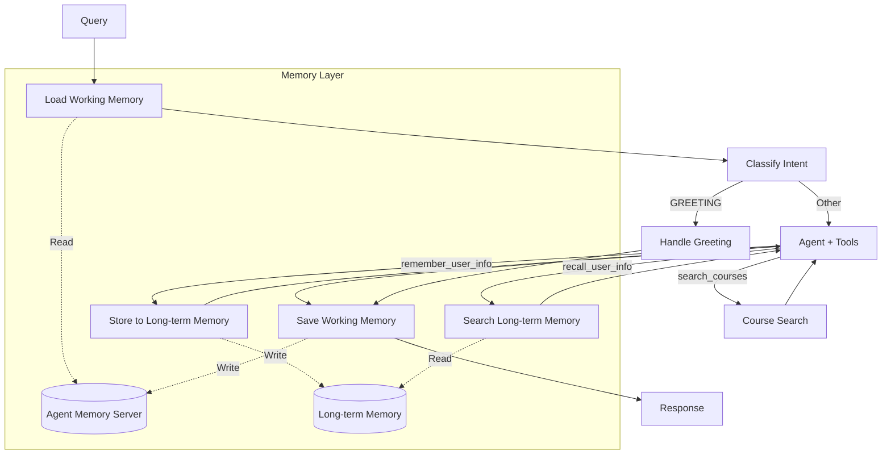

# Stage 6: Long-term Memory Tools

## 📍 Position in Learning Path

| Previous | Current | Next |
|----------|---------|------|
| [Stage 5: Memory](../stage5_memory_augmented/) or [Stage 5 ReAct](../stage5_react_memory/) | **Stage 6: Long-term Memory** | [Stage 7: Full ReAct](../stage7_react_loop/) |

This stage adds **long-term memory tools** for cross-session personalization and preference management.

---

## 🎯 Purpose

Stage 5 introduced working memory for session continuity. This stage adds **explicit long-term memory tools** that let the agent:
- Store user preferences that persist across sessions
- Recall preferences to personalize recommendations
- Combine working memory + long-term memory + RAG

**Key Learning**: "Long-term memory enables cross-session personalization. The agent remembers you."

---

## 📚 Related Notebooks

| Notebook | Concepts Applied | Implementation in This Stage |
|----------|-----------------|------------------------------|
| [Section 3: Working and Long-term Memory](../../notebooks/section-3-memory-systems/01_working_and_longterm_memory.ipynb) | Long-term memory types, persistence | `tools.py: remember_user_info, recall_user_info` |
| [Section 3: Combining Memory with Retrieved Context](../../notebooks/section-3-memory-systems/02_combining_memory_with_retrieved_context.ipynb) | Memory + RAG integration | Agent combines memory + search |
| [Section 4: Building Course Advisor Agent](../../notebooks/section-4-tools-and-agents/02_building_course_advisor_agent.ipynb) | Multi-tool agents | `agent_node()` with 3 tools |

### Key Notebook Concepts Demonstrated

**From Section 3, Notebook 1 - "Working and Long-term Memory":**
- **Long-term Memory Types**: Semantic (facts) vs Episodic (events)
- **Memory Persistence**: Cross-session storage
- **Memory Topics**: Organizing memories with tags

**From Section 4, Notebook 2 - "Building Course Advisor Agent":**
- **Multi-Tool Decision Making**: LLM chooses between 3 tools
- **Tool Composition**: Combining memory + search in single turn

**Study Path**: Read Section 3, Notebook 1's long-term memory section, then examine this stage's `tools.py` to see the implementation.

---

## 🔄 What Changed from Stage 5

| Feature | Stage 5 | Stage 6 |
|---------|---------|---------|
| **Working Memory** | Yes | Yes |
| **Long-term Memory** | No | **Cross-session** |
| **Tools** | 1 (search_courses) | **3** (search_courses + memory tools) |
| **Personalization** | Session-only | **Persistent preferences** |
| **Reasoning** | Hidden (tool-calling) | Hidden (tool-calling) |

---

## 🏗️ Architecture



## 🔧 Available Tools

| Tool | Purpose | Example Trigger |
|------|---------|-----------------|
| **search_courses** | Search course catalog | "Find ML courses" |
| **remember_user_info** | Store to long-term memory | "I prefer online courses" |
| **recall_user_info** | Search long-term memory | "What did I say I liked?" |

## 🚀 Usage

```bash
cd progressive_agents/stage6_longterm_memory

# Store preference then get recommendations
python cli.py --student-id alice "I prefer online courses"
python cli.py --student-id alice "What courses match my preferences?"

# Interactive mode
python cli.py --student-id alice
```

## 📝 Example: Personalized Recommendations

```
Turn 1:
User: "I want to focus on machine learning and prefer online courses"
Agent: [Calls remember_user_info with preferences]
       "I've noted your preferences. Let me find matching courses..."
       [Calls search_courses]
       "Here are some online ML courses that match your interests..."

Turn 2 (new session):
User: "What courses should I take?"
Agent: [Calls recall_user_info to retrieve preferences]
       [Calls search_courses with filters]
       "Based on your preference for online ML courses, I recommend..."
```

**Note:** `--student-id` is required! This identifies the student for long-term memory storage.

### Example Conversations

#### Session 1: Store Preferences

```
User: "Hi! I'm interested in machine learning. I prefer online courses."

Agent:
1. store_memory("Student is interested in machine learning", topics=["interests", "ML"])
2. store_memory("Student prefers online course format", topics=["preferences", "format"])
3. search_courses("machine learning")

Response: "I've noted that you're interested in machine learning and prefer online courses! 
Here are some ML courses available online: [course list]"
```

#### Session 2: Personalized Recommendations (New Session)

```
User: "What courses would you recommend?"

Agent:
1. search_memories("student preferences and interests")
   → Returns: "interested in ML", "prefers online"
2. search_courses("machine learning", ...)

Response: "Based on your interest in machine learning and preference for online courses, 
I recommend: [personalized course list]"
```

---

## Testing

### Run Memory Tools Test Suite

```bash
python test_memory_tools.py
```

This tests:
- ✅ Storing student preferences
- ✅ Retrieving memories in new session
- ✅ Multi-tool decision-making
- ✅ Cross-session persistence

### Run Simple Tests

```bash
python test_simple.py
```

---

## Implementation Details

### Memory Tools

#### search_memories_tool

```python
@tool("search_memories", args_schema=SearchMemoriesInput)
async def search_memories_tool(query: str, limit: int = 5) -> str:
    """Search student's long-term memory for preferences and facts."""
```

**Parameters:**
- `query`: Natural language query (e.g., "career goals", "preferences")
- `limit`: Max number of memories to return (default: 5)

**Returns:** Formatted list of memories with topics

#### store_memory_tool

```python
@tool("store_memory", args_schema=StoreMemoryInput)
async def store_memory_tool(
    text: str, 
    memory_type: str = "semantic", 
    topics: List[str] = []
) -> str:
    """Store important information to student's long-term memory."""
```

**Parameters:**
- `text`: Information to store (e.g., "Student prefers online courses")
- `memory_type`: "semantic" (facts) or "episodic" (events)
- `topics`: Tags for organization (e.g., ["preferences", "format"])

**Returns:** Confirmation message

---

## Educational Value

### What Stage 6 Teaches

1. **Long-term Memory Tools**
   - How to implement memory search/store as LangChain tools
   - When to use long-term vs working memory
   - Memory types (semantic vs episodic)

2. **Multi-Tool Decision Making**
   - LLM decides between 3 tools
   - Tool selection based on query intent
   - Combining multiple tools in single turn

3. **Personalization Patterns**
   - Storing user preferences
   - Retrieving context for personalization
   - Cross-session continuity

4. **Memory Management**
   - What to store (preferences, goals, constraints)
   - What NOT to store (temporary info, course details)
   - Using topics for organization

---

## Files Modified from Stage 5

| File | Changes | Lines Added |
|------|---------|-------------|
| `agent/tools.py` | Added 2 new tools + schemas | ~160 lines |
| `agent/nodes.py` | Updated tool binding + system prompt | ~30 lines |
| `agent/workflow.py` | Updated docstring | ~2 lines |
| `cli.py` | Updated titles | ~5 lines |

**Total:** ~200 lines of code added

---

## Troubleshooting

### "Error: Student ID not set"

**Cause:** `student_id` not passed to `run_agent_async()`

**Solution:** Always provide `student_id` parameter:
```python
result = await run_agent_async(
    agent=agent,
    query=query,
    session_id=session_id,
    student_id="alice",  # Required!
    enable_caching=False,
)
```

### "No relevant memories found"

**Cause:** No memories stored yet for this student

**Solution:** First share preferences to store memories:
```
User: "I prefer online courses and I'm interested in ML"
```

### Agent Memory Server not available

**Cause:** Agent Memory Server not running

**Solution:** Start the server:
```bash
# Check if running
curl http://localhost:8088/health

# Start if needed (see Agent Memory Server docs)
```

---

## 🔗 Related Resources

### Learning Path Navigation
- **Previous**: [Stage 5: Memory](../stage5_memory_augmented/) or [Stage 5 ReAct](../stage5_react_memory/)
- **Next**: [Stage 7: Full ReAct](../stage7_react_loop/) - Complete implementation with visible reasoning

### Notebooks to Study
- **[Section 3: Working and Long-term Memory](../../notebooks/section-3-memory-systems/01_working_and_longterm_memory.ipynb)**: Long-term memory fundamentals
- **[Section 4: Building Course Advisor Agent](../../notebooks/section-4-tools-and-agents/02_building_course_advisor_agent.ipynb)**: Multi-tool agent patterns
- **[Section 4: Semantic Tool Selection](../../notebooks/section-4-tools-and-agents/04_semantic_tool_selection.ipynb)**: Scaling to more tools

### Technical Resources
- **Agent Memory Server**: https://github.com/redis/agent-memory-server

