# Stage 7: Full Memory with ReAct Loop

## 📍 Position in Learning Path

| Previous | Current | Next |
|----------|---------|------|
| [Stage 6: Long-term Memory](../stage6_longterm_memory/) or [Stage 5 ReAct](../stage5_react_memory/) | **Stage 7: Full ReAct** | — (Final Stage) |

The **final stage** combining all features: working memory, long-term memory, and **visible ReAct reasoning**.

---

## 🎯 Purpose

This is the culmination of the progressive agents learning path. It combines:
- **Working Memory** (from Stage 5): Session continuity
- **Long-term Memory** (from Stage 6): Cross-session personalization
- **ReAct Pattern** (from Stage 4 ReAct): Visible reasoning

**Key Learning**: "A production-ready agent combines memory, tools, and transparent reasoning."

---

## 📚 Related Notebooks

This stage demonstrates concepts from all notebook sections:

| Notebook | Concepts Applied | Implementation in This Stage |
|----------|-----------------|------------------------------|
| [Section 4: Tools and LangGraph Fundamentals](../../notebooks/section-4-tools-and-agents/01_tools_and_langgraph_fundamentals.ipynb) | ReAct pattern | `react_agent.py: ReActAgent` |
| [Section 3: Working and Long-term Memory](../../notebooks/section-3-memory-systems/01_working_and_longterm_memory.ipynb) | Both memory types | `nodes.py`, `tools.py` |
| [Section 3: Combining Memory with Retrieved Context](../../notebooks/section-3-memory-systems/02_combining_memory_with_retrieved_context.ipynb) | Memory + RAG | Agent combines all sources |
| [Section 4: Building Course Advisor Agent](../../notebooks/section-4-tools-and-agents/02_building_course_advisor_agent.ipynb) | Multi-tool agents | 3 tools with decision-making |
| [Section 2: Crafting and Optimizing Context](../../notebooks/section-2-retrieved-context-engineering/02_crafting_and_optimizing_context.ipynb) | Progressive disclosure | `HierarchicalContextAssembler` |

### Key Notebook Concepts Demonstrated

**From Section 4, Notebook 1 - "Tools and LangGraph Fundamentals":**
- **ReAct Pattern**: Thought → Action → Observation loop
- **Visible Reasoning**: Debug-friendly decision traces

**From Section 3, Notebooks 1-2 - Memory Systems:**
- **Working Memory**: Session-scoped conversation storage
- **Long-term Memory**: Cross-session preference persistence
- **Memory + RAG**: Combining all context sources

**From Section 4, Notebook 2 - "Building Course Advisor Agent":**
- **Multi-Tool Decision Making**: LLM chooses between 3 tools
- **Tool Composition**: Combining memory + search in single turn

**Study Path**: This stage integrates all previous concepts. Review earlier stages and notebooks to understand each component.

---

## 🔄 What Changed from Stage 6

| Feature | Stage 6 | Stage 7 |
|---------|---------|---------|
| **Working Memory** | Yes | Yes |
| **Long-term Memory** | Yes | Yes |
| **Tools** | 3 | 3 (same) |
| **Reasoning** | Hidden (tool-calling) | **Visible (ReAct)** |
| **Debugging** | Harder | **`--show-reasoning` flag** |

---

## 🏗️ Architecture

```mermaid
graph TD
    Q[Query] --> LM[Load Working Memory]
    LM --> IC[Classify Intent]
    IC -->|GREETING| HG[Handle Greeting]
    IC -->|Other| RA[ReAct Agent]

    subgraph ReAct Loop
        RA --> T1[💭 Thought: Analyze + plan]
        T1 --> A1[🔧 Action: choose tool]
        A1 --> O1[👁️ Observation: Results]
        O1 --> T2[💭 Thought: Evaluate]
        T2 --> |Need more| A1
        T2 --> |Done| F[✅ FINISH]
    end

    subgraph Available Tools
        A1 -->|search| SC[search_courses]
        A1 -->|store| RM[remember_user_info]
        A1 -->|recall| RC[recall_user_info]
    end

    F --> SM[Save Working Memory]
    HG --> SM
    SM --> END[Response + Reasoning Trace]

    subgraph Memory Layer
        LM -.->|Read| AMS[(Agent Memory Server)]
        SM -.->|Write| AMS
        RM -.->|Write| LTM[(Long-term Memory)]
        RC -.->|Read| LTM
    end
```



## 🔧 Available Tools

| Tool | Purpose | Example Trigger |
|------|---------|-----------------|
| **search_courses** | Search course catalog | "Find ML courses" |
| **remember_user_info** | Store to long-term memory | "I prefer online courses" |
| **recall_user_info** | Search long-term memory | "What did I say I liked?" |

## 🚀 Usage

```bash
cd progressive_agents/stage7_react_loop

# Show reasoning trace
python cli.py --student-id alice --show-reasoning "What ML courses are good for beginners?"

# Store preference with visible reasoning
python cli.py --student-id alice --show-reasoning "I prefer online courses"

# Interactive mode
python cli.py --student-id alice
```

## 📝 Example: Full Pipeline with Reasoning

```
User: "I prefer online courses. What ML courses do you recommend?"

🧠 Reasoning Trace:
================================================================================
💭 Thought: The user expressed a preference AND asked for recommendations.
            I should store the preference first, then search for courses.

🔧 Action: remember_user_info
   Input: {"user_id": "alice", "info_type": "preference", "info": "prefers online courses"}
👁️  Observation: Successfully stored user preference.

💭 Thought: Now I should search for ML courses, filtering for online format.

🔧 Action: search_courses
   Input: {"query": "machine learning", "intent": "GENERAL", "search_strategy": "hybrid"}
👁️  Observation: Found 5 courses: CS002 (ML Fundamentals, Online), ...

💭 Thought: I have courses and stored the preference. I can provide recommendations.

✅ FINISH
================================================================================

Answer: I've noted your preference for online courses! Here are some ML courses available online:
        1. CS002 - Machine Learning Fundamentals (Online, Beginner)
        2. CS006 - Deep Learning and Neural Networks (Online, Advanced)
        ...
```

## 📁 File Structure

```
stage7_react_loop/
├── cli.py                    # CLI with --show-reasoning
├── README.md                 # This file
└── agent/
    ├── __init__.py
    ├── react_agent.py        # ReAct loop implementation
    ├── react_parser.py       # Thought/Action/Observation parser
    ├── react_prompts.py      # System prompt with 3 tools
    ├── nodes.py              # Memory nodes + react_agent_node
    ├── tools.py              # search_courses, remember, recall
    ├── state.py              # WorkflowState with reasoning_trace
    ├── setup.py              # Initialization
    └── workflow.py           # LangGraph graph
```

## ⬅️ Previous Stages

- **Stage 6** (`stage6_longterm_memory/`): Same tools but hidden reasoning
- **Stage 5R** (`stage5_react_memory/`): ReAct + working memory (no long-term)
- **Stage 4R** (`stage4_react_hybrid_search/`): ReAct + hybrid search (no memory)

**Note:** `--student-id` is required! This identifies the student for long-term memory storage.

### Example Conversations

#### Session 1: Store Preferences

```
User: "Hi! I'm interested in machine learning. I prefer online courses."

Agent:
1. store_memory("Student is interested in machine learning", topics=["interests", "ML"])
2. store_memory("Student prefers online course format", topics=["preferences", "format"])
3. search_courses("machine learning")

Response: "I've noted that you're interested in machine learning and prefer online courses! 
Here are some ML courses available online: [course list]"
```

#### Session 2: Personalized Recommendations (New Session)

```
User: "What courses would you recommend?"

Agent:
1. search_memories("student preferences and interests")
   → Returns: "interested in ML", "prefers online"
2. search_courses("machine learning", ...)

Response: "Based on your interest in machine learning and preference for online courses, 
I recommend: [personalized course list]"
```

---

## Testing

### Run Memory Tools Test Suite

```bash
python test_memory_tools.py
```

This tests:
- ✅ Storing student preferences
- ✅ Retrieving memories in new session
- ✅ Multi-tool decision-making
- ✅ Cross-session persistence

### Run Simple Tests

```bash
python test_simple.py
```

---

## Implementation Details

### Memory Tools

#### search_memories_tool

```python
@tool("search_memories", args_schema=SearchMemoriesInput)
async def search_memories_tool(query: str, limit: int = 5) -> str:
    """Search student's long-term memory for preferences and facts."""
```

**Parameters:**
- `query`: Natural language query (e.g., "career goals", "preferences")
- `limit`: Max number of memories to return (default: 5)

**Returns:** Formatted list of memories with topics

#### store_memory_tool

```python
@tool("store_memory", args_schema=StoreMemoryInput)
async def store_memory_tool(
    text: str, 
    memory_type: str = "semantic", 
    topics: List[str] = []
) -> str:
    """Store important information to student's long-term memory."""
```

**Parameters:**
- `text`: Information to store (e.g., "Student prefers online courses")
- `memory_type`: "semantic" (facts) or "episodic" (events)
- `topics`: Tags for organization (e.g., ["preferences", "format"])

**Returns:** Confirmation message

---

## Educational Value

### What Stage 6 Teaches

1. **Long-term Memory Tools**
   - How to implement memory search/store as LangChain tools
   - When to use long-term vs working memory
   - Memory types (semantic vs episodic)

2. **Multi-Tool Decision Making**
   - LLM decides between 3 tools
   - Tool selection based on query intent
   - Combining multiple tools in single turn

3. **Personalization Patterns**
   - Storing user preferences
   - Retrieving context for personalization
   - Cross-session continuity

4. **Memory Management**
   - What to store (preferences, goals, constraints)
   - What NOT to store (temporary info, course details)
   - Using topics for organization

---

## Files Modified from Stage 5

| File | Changes | Lines Added |
|------|---------|-------------|
| `agent/tools.py` | Added 2 new tools + schemas | ~160 lines |
| `agent/nodes.py` | Updated tool binding + system prompt | ~30 lines |
| `agent/workflow.py` | Updated docstring | ~2 lines |
| `cli.py` | Updated titles | ~5 lines |

**Total:** ~200 lines of code added

---

## Troubleshooting

### "Error: Student ID not set"

**Cause:** `student_id` not passed to `run_agent_async()`

**Solution:** Always provide `student_id` parameter:
```python
result = await run_agent_async(
    agent=agent,
    query=query,
    session_id=session_id,
    student_id="alice",  # Required!
    enable_caching=False,
)
```

### "No relevant memories found"

**Cause:** No memories stored yet for this student

**Solution:** First share preferences to store memories:
```
User: "I prefer online courses and I'm interested in ML"
```

### Agent Memory Server not available

**Cause:** Agent Memory Server not running

**Solution:** Start the server:
```bash
# Check if running
curl http://localhost:8088/health

# Start if needed (see Agent Memory Server docs)
```

---

## 🔗 Related Resources

### Learning Path Summary
This is the **final stage**. You've learned:
- **Stages 1-2**: Context engineering fundamentals
- **Stage 3**: LangGraph agent architecture
- **Stage 4**: Hybrid search with NER
- **Stage 4 ReAct**: Visible reasoning pattern
- **Stage 5**: Working memory for sessions
- **Stage 6**: Long-term memory for personalization
- **Stage 7**: All features combined

### Notebooks to Review
- **[Section 1: What is Context Engineering?](../../notebooks/section-1-context-engineering-foundations/01_what_is_context_engineering.ipynb)**: Foundation concepts
- **[Section 3: Working and Long-term Memory](../../notebooks/section-3-memory-systems/01_working_and_longterm_memory.ipynb)**: Memory fundamentals
- **[Section 4: Tools and LangGraph Fundamentals](../../notebooks/section-4-tools-and-agents/01_tools_and_langgraph_fundamentals.ipynb)**: ReAct pattern
- **[Section 4: Building Course Advisor Agent](../../notebooks/section-4-tools-and-agents/02_building_course_advisor_agent.ipynb)**: Complete agent architecture

### Technical Resources
- **Agent Memory Server**: https://github.com/redis/agent-memory-server
- **LangGraph Documentation**: https://langchain-ai.github.io/langgraph/

### What's Next?
After completing Stage 7, explore:
- **[Section 4: Semantic Tool Selection](../../notebooks/section-4-tools-and-agents/04_semantic_tool_selection.ipynb)**: Scaling to more tools
- **[Section 3: Managing Long Conversations](../../notebooks/section-3-memory-systems/03_manage_long_conversations_with_compression_strategies.ipynb)**: Memory compression
- **Reference Agent**: Production-ready implementation in `reference-agent/`

